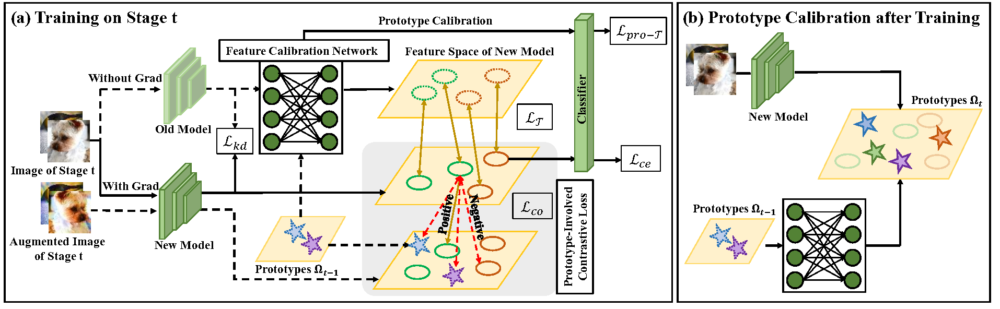

# FCS: Feature Calibration and Separation for Non-Exemplar Class Incremental Learning

Official implementation of "[FCS: Feature Calibration and Separation for Non-Exemplar Class Incremental Learning](https://openaccess.thecvf.com/content/CVPR2024/html/Li_FCS_Feature_Calibration_and_Separation_for_Non-Exemplar_Class_Incremental_Learning_CVPR_2024_paper.html)"


<p align="center"></p>


## Requirements

### Environment
Python 3.7.13

PyTorch 1.8.1


## Run commands
Json files for different experinments are provided in ./exps/fcs/

### Run algorithms on CIFAR100-5stages
```shell
python main.py --config=./exps/fcs/cifar100/5/first_stage.json # base stage
python main.py --config=./exps/fcs/cifar100/5/second_stage.json # incremental learning
```
## Results

Results for different experinments are provided in ./files/results.txt
## Acknowledgement

This project is mainly based on [PyCIL](https://github.com/G-U-N/PyCIL).

## Citation

If you find this work helpful, please cite:
```
@inproceedings{li2024fcs,
  title={FCS: Feature Calibration and Separation for Non-Exemplar Class Incremental Learning},
  author={Li, Qiwei and Peng, Yuxin and Zhou, Jiahuan},
  booktitle={Proceedings of the IEEE/CVF Conference on Computer Vision and Pattern Recognition},
  pages={28495--28504},
  year={2024}
}

```

## Contact

Welcome to our Laboratory Homepage ([OV<sup>3</sup> Lab](https://zhoujiahuan1991.github.io/)) for more information about our papers, source codes, and datasets.
